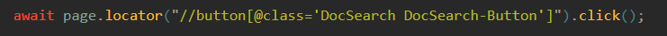
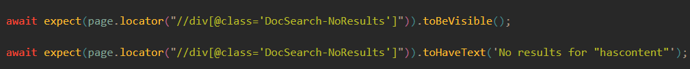
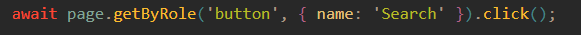
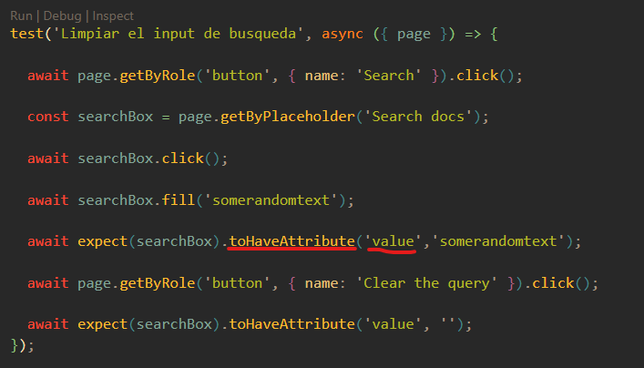
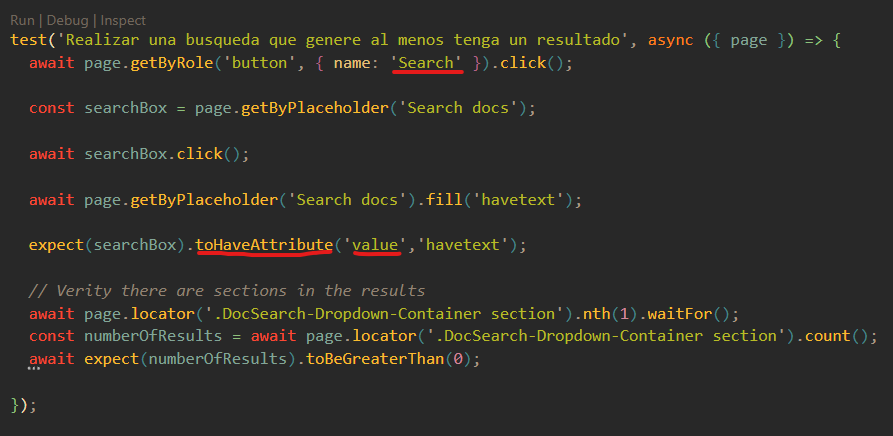

# Soluciones al reto

## Primer test

Para solcuionar el primer test use los lacator con un mapeo del Xpath, esta es una forma que no habia usado en mis otros test.

Esta es la solucion:
_Mapeo del search de la pagina_

_Expects y mapeo_

_Otra forma de mapear el serch_

## Segundo test

Para solucionar el error del segundo test, se tenia que ir de la mano el reporte que genera playwrigth ya que a simple vista no esta mal, pero usando el debug se puede observar que en el ejeccio en la _linea 29_ se esta tratando de optener un texto cuando lo que retorna ese elemento es un atributo por eso se modifica como se muestra en la solucion.

Esta es la solucion:

## Tercer test

El tercer test presentaba el mismo error que el test 2 y tenia un error de espacio de un espacio en blanco en mapeo del boton search en la solucion se resaltan los cambios.

Esta es la solucion:

# Reto#2 Repara los tests

En este reto vas a encontrar tests que en este momento no funcionan, tu misión repararlos para que vuelvan a funcionar

- [Instalación](#instalación)
- [Pruebas](#pruebas)
- [Como enviar tu solución](#como-enviar-tu-solución)
- [Licencia](#licencia)
- [Credits](#credits)

## Instalación

1. Hacer el fork de este proyecto en tu espacio personal
1. Clonar el repositorio desde tu espacio personal en tu computadora
1. Instalar dependencias, con el comando `npm install`

## Pruebas

Las pruebas end to end corren bajo playwright con el comando `npx playwright test` y ya esta incluido como parte de las dependencias del proyecto, sin embargo, antes de correr el comando, asegúrate de correr `npm install` para instalar los requerimientos de playwright para correr pruebas.

Cuando corras el comando `npx playwright test` por primera vez las pruebas van a fallar y se verán así:

Una vez repares todos los tests deberías pasar todas las pruebas y se verán así:

> Puedes ir corriendo el comando `npx playwright test` de las funcionalidades que vayas creando para ir evaluando que vas por buen camino.

## Como enviar tu solución

Debes de hacer un "Fork" de este proyecto, revolver los problemas y crear un Pull Request hacia este repositorio.

## Licencia

Este proyecto se lanza bajo la licencia [MIT](https://opensource.org/licenses/MIT).
